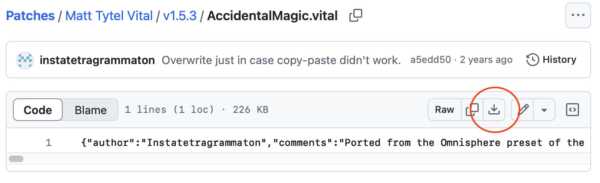

# Where to buy

https://vital.audio/

# About

Matt Tytel is well known for [Helm](https://tytel.org/helm/) - a great free software synthesizer. 3 years in the making and released in November 2020, Vital is an incredibly powerful wavetable "supersynth" that takes all the things that made Massive and Serum great and improves yet again on them.

The interface combines both drag & drop with a modulation matrix, and programming is fluent and accurate. There is no lack of modulation sources and targets, and important targets all run at audio rates.

Backed by a strong community with lots of skilled sound designers, this is an incredibly promising plugin with a bright future.

## Vital Pro and patch redistribution

I have the Vital Pro version. This version ships with more presets and wavetables than the regular Vital Basic version. In some of the patches, I use wavetables that may only be available in the Pro version. This means that the patches can not be redistributed in a 100% free fashion.

The patches in a folder called "UsingFactoryContent" assume you have a version of Vital with any of the included wavetables. All patches outside of it are free from factory content.

Thanks to [@riban-bw](https://github.com/riban-bw), this set now also appears in [Zynthian](https://github.com/zynthian/zynthian-data/tree/master/presets/lv2/Vitalium_instatetragrammaton.lv2)!

# How to download presets

Vital patches - with the extension .vital - are just text files that contain [JSON](https://en.wikipedia.org/wiki/JSON). Github is a bit confused by this, and will display the patches as text files too.

To download individual patches, use the "Download raw" button shown here:



# How to install presets

In Vital, click the hamburger menu (it looks like ☰) and choose "Open External Preset". Then, navigate to the preset you downloaded, and select it. Alternatively, choose "Browse presets" and right-click any preset, then choose "Open File Location". This shows you where presets are installed.

For Windows, it's `%userprofile%\Documents\Vital\`. If you just type `%userprofile%` in your file explorer, it'll automatically jump to `C:\Users\Your Name\` - assuming that your user folder is installed on your C drive.

You can easily create categories per user. You could create a new folder called `%userprofile%\Documents\Vital\Instatetragrammaton\Presets`. In there, you can just copy all the `.vital` files, and they'll show up in the plugin. Depending on which version you're running, you may need to re-instantiate it.\

# My patch doesn't work!

If you're on an older version of Vital or the free version, you might get an error that says something like "This patch was made with a newer version". Here's how to fix it.

Open the .vital patch with an application like Windows Notepad or [VS Code on MacOS](https://code.visualstudio.com) (this seems overkill, but all notepad-like applications don't seem free). You'll notice that it is a text file.

Scroll all the way to the bottom and it'll say something like this:

```json
"version":"1.5.3"}]},"synth_version":"1.5.3"}
```

Change this to:

```json
"version":"1.0.0"}]},"synth_version":"1.0.0"}
```

and save the file.

Unless the patch uses specific features which are only available in that version of Vital, this should make the patch work. The reason for this is so that newer features won't make older versions of Vital crash - think of new warping modes etc.

Wavetables are stored in base64 format inside of the file, which means that if a wavetable was created with a paid feature such as Text-To-Wavetable - it'll still work just fine on a free version. Generating the TTWT is what costs money, not distributing it.
