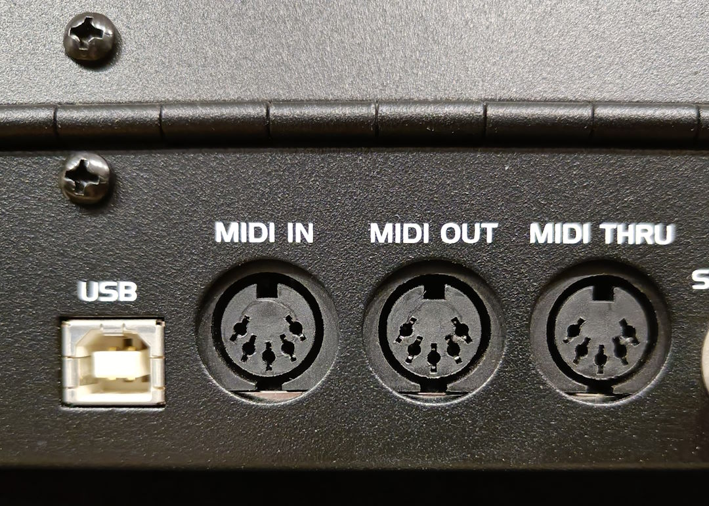
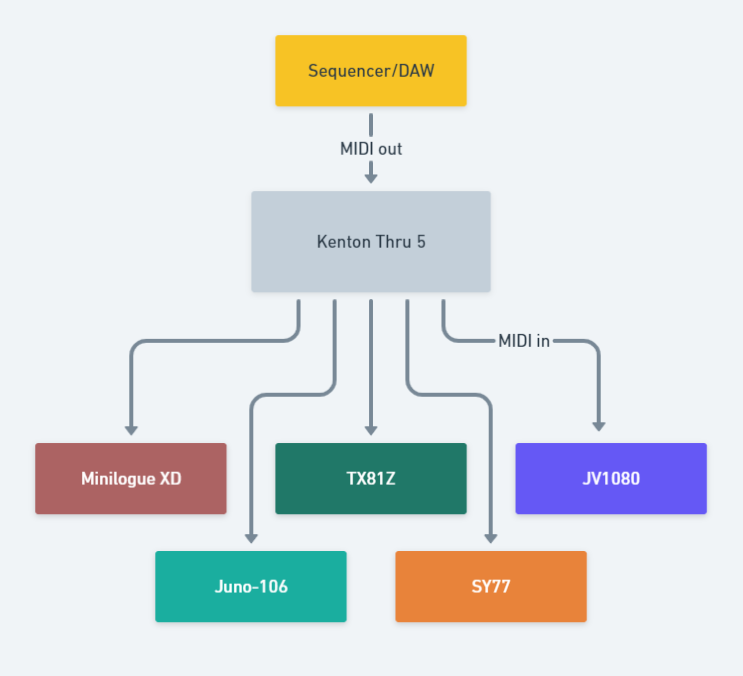
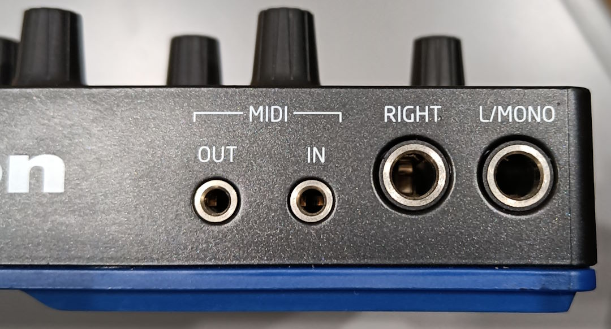

# MIDI

**M**usical **I**nstrument **D**igital **I**nterface - one of the best inventions ever with only a few drawbacks. 

MIDI is digital sheet music. MIDI is to audio as sheet music is to a CD; sheet music tells you what to play, but not what it sounds like; a CD tells you what it sounds like, but not how to play it.

## Old School

This is a 1983 protocol which means that it doesn't need any drivers of any sort, and since it's been around for so long, it'll be bound to work when everything with USB and proprietary drivers has bitten the dust.

MIDI screams into the void. It does not care if there's a device on the other side or not; it has no way of establishing this. It does not know what device is on the other side - it might be a synthesizer, a sequencer, or an art installation with all kinds of lights; it does not matter. 

This means that solving MIDI problems is mostly a matter of checking whether the receiver is listening to the same channel that the sender is sending on.

## Connectors

MIDI connectors look like this:

These connectors are called 5-pin [DIN](https://en.m.wikipedia.org/wiki/Deutsches_Institut_f%C3%BCr_Normung) plugs.

That means if you have this on the back of your synth, you don't need a computer to connect to other synths.

## Mnemonic

Remember: MIDI goes OUT of the sequencer IN to the synth, so you should not match the labels!

## Thru

While in and out are self-explanatory - one receives MIDI, the other sends it - thru requires some additional explanation.

The MIDI thru port immediately copies the messages that arrive via the MIDI in port.

This allows you to daisy-chain synthesizers, for instance:

* Sequencer MIDI out > Synthesizer 1 MIDI in
* Synthesizer 1 MIDI thru > Synthesizer 2 MIDI in
* Synthesizer 2 MIDI thru > Synthesizer 3 MIDI in
* Synthesizer 3 MIDI thru > Synthesizer 4 MIDI in
* and so on

This means you don't need a MIDI patchbay. The drawbacks are:

* You can only use 16 MIDI channels, and each synthesizer in the chain takes 1 away
* Debugging this kind of setup can get challenging difficult
* Some gear will receive on every MIDI channel and must be explicitly instructed to not do this.
* Modern gear does not always have a MIDI thru anymore.

The latter is especially an issue, but it can be solved with a thru box, such as a [Kenton Thru 5](https://kentonuk.com/product/thru-5/).

The diagram looks like this:

.

This turns a [bus topology](https://en.m.wikipedia.org/wiki/Bus_network) into a [star topology](https://en.m.wikipedia.org/wiki/Star_network).

## Type A and Type B

On newer controllers and synthesizers, the MIDI connectors may look like this:

For this you need a so-called Type A or Type B cable. This acts as a converter that converts 3.5mm TRS MIDI to 5-pin DIN. Once it's 5-pin DIN, it can talk to other devices - the Type A and Type B is only required for the device with the 3.5mm input itself.

Whether you have Type A or Type B depends on the manufacturer. You can not directly connect a Type A MIDI output to a Type B MIDI input with a 3.5mm TRS to 3.5mm TRS cable.

**WARNING**: these connectors must not be mistaken for CV/Gate!

## Computers

If you want to use a computer, you need an USB MIDI interface. Some [audio interfaces](Audio-Interface.md) have 5-pin DIN connectors on the back; that means your audio interface is also a MIDI interface.

If you buy a controller with a 5-pin MIDI port (or two), it can act as a MIDI interface as well. Often this is only a MIDI out port, however.

MIDI interfaces can consist of a cable with an USB connector on one end and 2 5-pin MIDI connectors on the other, such as the [Roland UM One MK2](https://www.roland.com/global/products/um-one_mk2/) or the [ESI MIDIMate eX](https://www.esi-audio.com/products/midimateex/).

There are also rack units which have 8 MIDI in and 8 MIDI out ports, such as the [MOTU MIDI Express 128](https://motu.com/products/midi/128), the [ESI M8U eX](https://www.esi-audio.com/products/m8uex/) or the [iConnectivity MIOXL](https://www.iconnectivity.com/mioxl). 

Because MIDI is a 1983 protocol, your computer will only know that there's an interface connected to it; it will not know what kind of synths or devices are on the other end - since MIDI does not announce this.

## Drawbacks

MIDI is a serial protocol and it's relatively slow. That means that if you play a chord, the notes will arrive each one by one - so the 3rd note will be later than the first. When large amounts of MIDI data are sent, some notes may be delayed because there are other messages getting precedent (think for instance of controller signals). For a 16-channel multi-timbral module it may be advisable to send each MIDI track separately when it needs to be recorded to audio.

MIDI via USB may suffer from timing issues, because USB cannot guarantee timely arrival. Since MIDI is not timestamped either, this can not be recovered.
