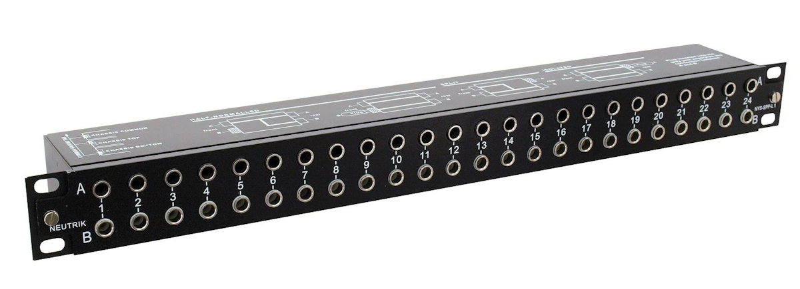
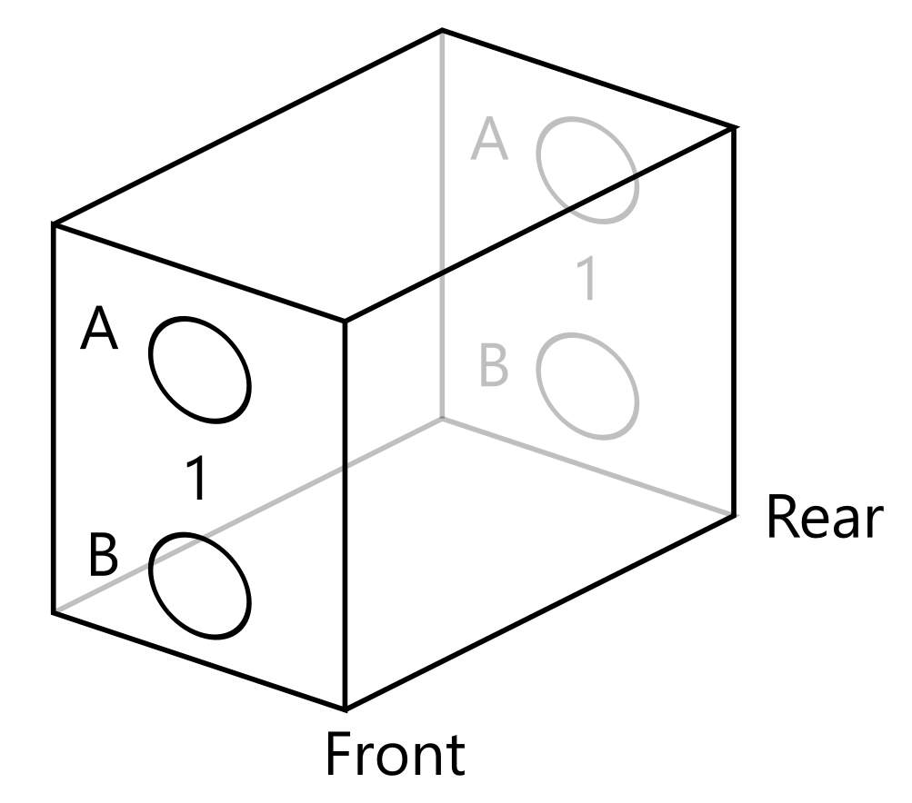
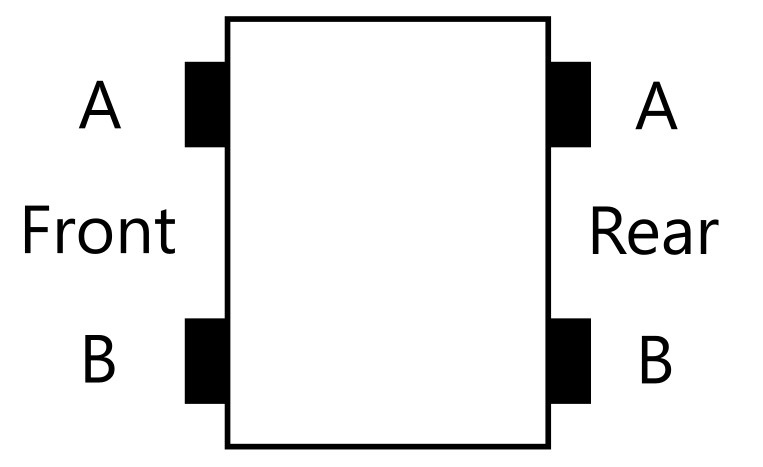
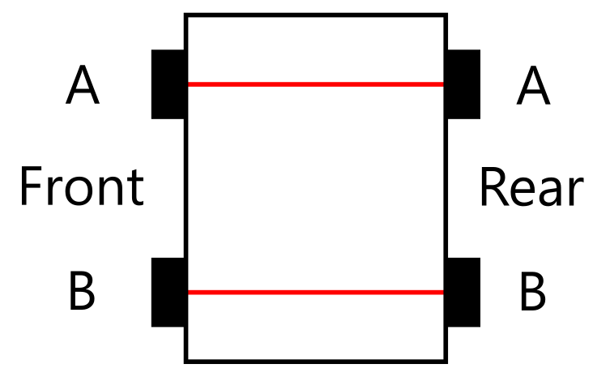
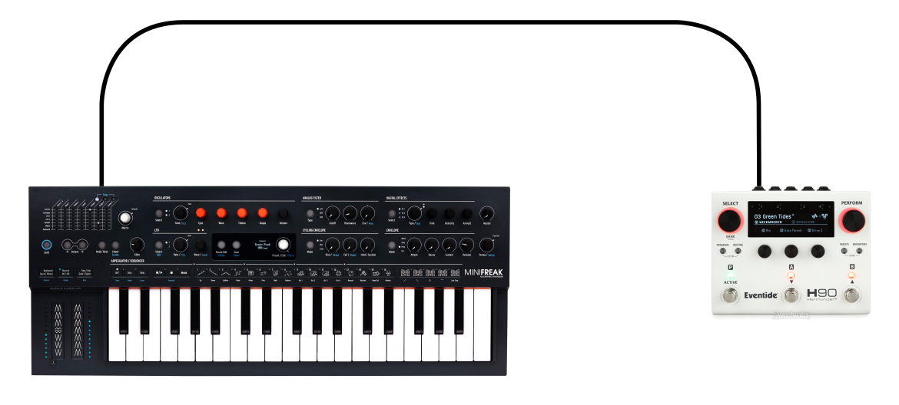
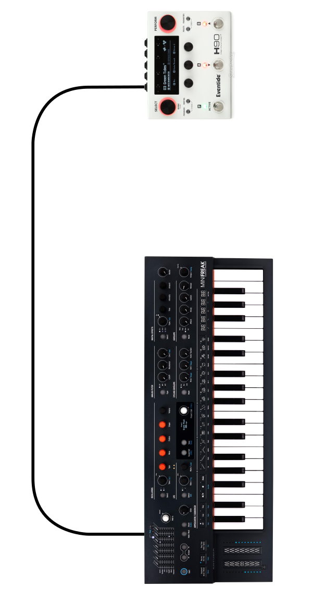
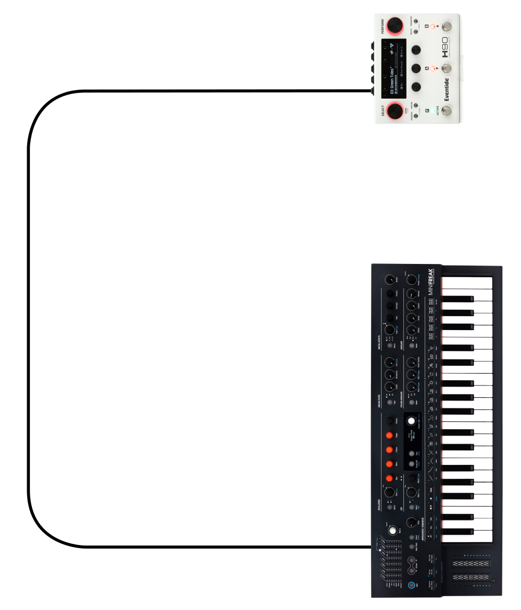
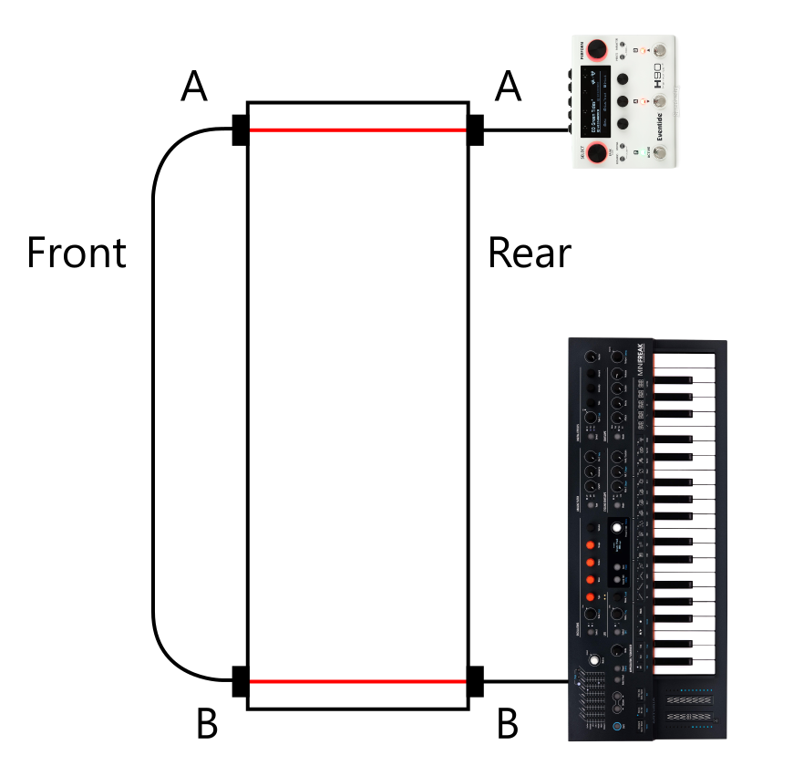
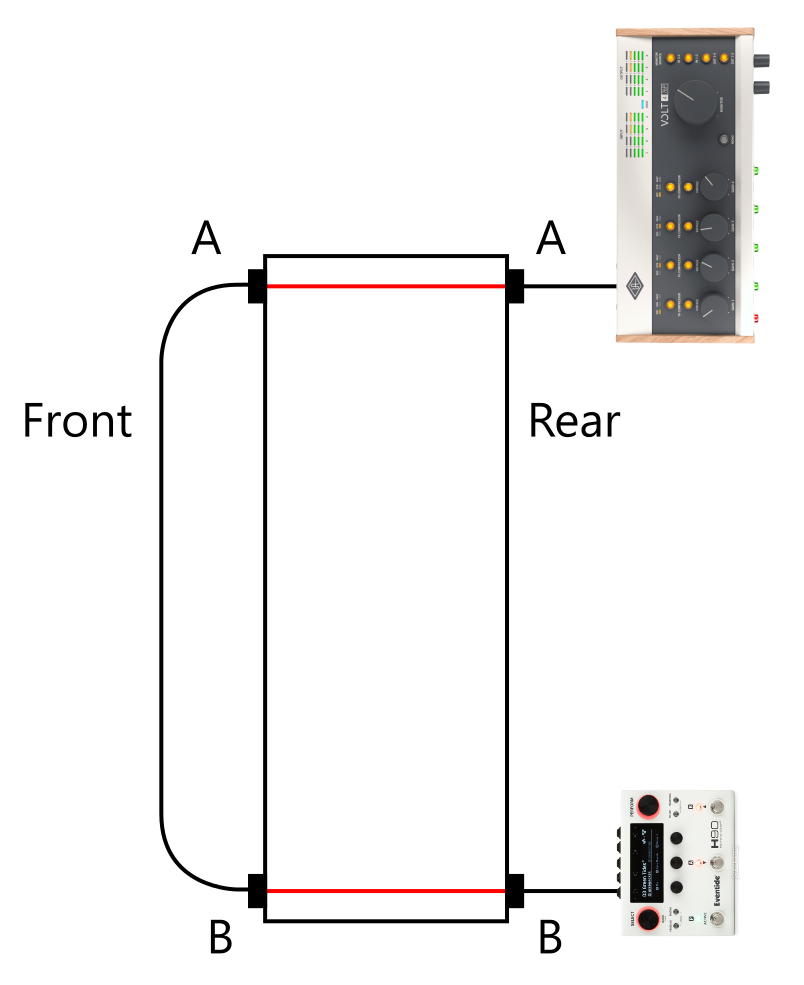

# Patchbays

This is a patchbay.

.

For the longest time I didn't really understand how patchbays worked, but I've found a pretty good way to explain them - for myself and for others.

This patchbay contains the following block 24 times in a row.

.

Each block has a number. There are 4 inputs in each block - two on the front, two on the rear - so by saying "Rear B 14" you can uniquely identify such an input.

Since each block is identical, we can just start by looking at a single one from the side.

.

In the so-called "split" configuration, the inputs are connected to the outputs like this:

.

This means that anything going into front A will be connected to rear A, and anything going into front B will be connected to rear B. You could theoretically use this to extend the length of a cable.

Now for something completely different. You hook up a synthesizer to an effect.

.

If you want to swap the synthesizer for another, you have to unplug it, and plug in another synth. If you want to swap the effect for another, you have to unplug it, and plug in another effect. This works fine when everything is in reach - but not so fine if you have a rackmount effect, or when your cables aren't of the correct length, or when you can't easily move the synth (or the effect).

.

Now, let's imagine we can easily stretch the cable.

.

Now, let's cut those cables and replace them with the block in the patchbay.

.

What this means is:

- all your effects and synthesizers can be plugged into your patchbay
- to keep things consistent, audio goes IN to the bottom row (B), and audio comes OUT of the top row (A)
- normally, a cable will go from front B to front A when the number corresponds.
- by plugging a cable from front B 1 into front A 3, the audio coming from the Minifreak suddenly goes somewhere else. Perhaps rear A 3 is connected to a different effect.

This works also with audio interfaces:

.

In that case, the outputs of the H90 come in via rear B, and the patchbay's rear A is connected to the input of the audio interface.

This is confusing at first unless you follow the iron rule that says:

- audio may only come in via the rear on the bottom row (so the bottom row on the rear are inputs only)
- audio may only go out via the rear on the top row (so the top row on the rear are outputs only)
- careful labeling is your friend.

... and suddenly, connecting multiple effects in a chain becomes trivially easy. The best part is that you can keep your effects in exactly the same place; nothing there needs to be moved or unplugged. All the plugging and moving happens on the patchbay itself only.

The best part is that patchbays can be set up so that you don't even need to plug in a cable from B front to A front. The so-called normaled connection setup already takes care of this and will always automatically route audio from rear B to rear A - unless you plug in a cable into B front, which overrides this connection.

Patchbays can be configured in several interesting ways, but start with getting the basic approach down; it turns your effects setup into a semi-modular one.
