# Stepper and Performer

Massive has several powerful modulation features that go beyond the regular LFO and envelope. These are the Stepper and the Performer.
Both of these are __unipolar__ modulation sources. That means that the value they generate is added to the modulation target.

The modulation amount can however be set to a negative number, which means that they can also subtract.

Conceptually, it's best to compare the Stepper and Performer to DAW automation. You draw the shape of the pitch, the volume or filter cutoff by means of pre-set curves or a bar graph.

To make things easy at the start, ensure that _Pos_, _Sync_ and _Restart_ are always enabled for Steppers, Performers and LFOs.

_Pos_ works together with _Restart_. If both _Pos_ and _Restart_ are disabled, the modulation stops when you release the key, 
and continues from the same spot if you press it again. If _Pos_ is enabled but _Restart_ is not, the clock keeps running in the meantime - so it will pick up where it left off as if you didn't release the key.
_Restart_ by itself just means that it restarts on every new keypress. _Sync_ synchronizes it to the BPM.

# Stepper

## Melodic sequences in one octave

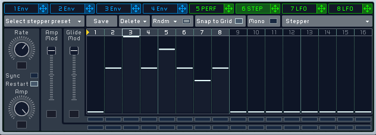

The stepper can be used to generate little melodies. In this example, I've created a variation on the melody of [Vangelis - Dervish D.](https://www.youtube.com/watch?v=3TB4UEu_hak).

Transposed to C, the melody's notes are:

```
C1-G1-C2-G1-Bb1-G1-F1-G1
```

In semitones, this is equal to:

```
0-7-12-7-10-7-5-7
```

To let one oscillator play a melody, all you need to do is to assign the Stepper to the oscillator pitch, and set the modulation amount to +12.

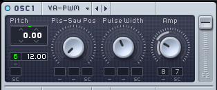

As long as the melody "fits" in a single octave, this is how you can create melodic sequences. The *Snap to Grid* can help here, because it'll lock any step to an integer between 0 and 12. (Holding `Alt` while dragging a step will also snap to whole numbers).

## Melodic sequences over two octaves

Here's a different melody:

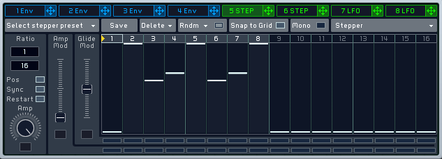

Currently, step 5 is a C2. If I want it to be a Eb2, there are a few choices.

First, I can of course increase the modulation amount to oscillator 1 to +24. This gives me a 2 octave range. However, it also requires me to manually halve every step. Given that *Snap to Grid* only works from 0 to 12, I'd lose accuracy - and setting a value of 2.5 is far more difficult.

As an alternative, I can use another Stepper and combine the outputs of both. This Stepper only has to add a value at step nr 5, so it looks like this:

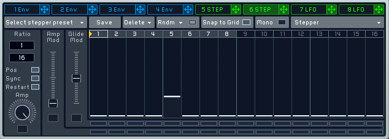

The oscillator pitch has two slots, so I can just add the other Stepper to this as well and set the modulation amount to +12, too.

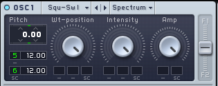

When Stepper 1 generates a +12, Stepper 2 generates a +3 - and 12 + 3 = 15 semitones in total from the base.

## Melodic sequences over three octaves

Of course, there's a trade-off; an oscillator's pitch can only be modulated by two sources at a time. If I want to also incorporate lower notes (effectively  in my sequence, a potential solution is to choose another oscillator and send a different Stepper signal to it - then crossfade quickly between the oscillators when required.

In modular/semimodular synthesizers, this is solved by first mixing the modulation signals. Massive does not have such a feature, so workarounds like these are necessary.

# Performer

# Percussion


The Performer provides 2 lanes of automation. Instead of drawing automation like you'd do on an envelope with multiple breakpoints, you can only draw segments of curves.

Personally, I've always found this a great trade-off; it's much faster to program rhythmical sequences this way.

For instance, routing this Performer to the pitch and amplifier of a sinewave oscillator generates a kick drum:
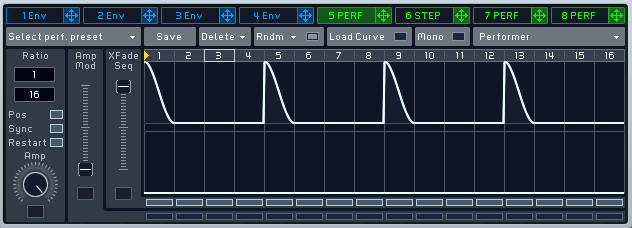

Routing this performer to the amplifier of the noise oscillator (set to "Metal") gets you something like a hihat.
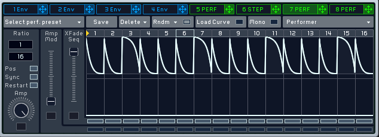

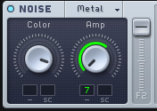

## 32-step Patterns

In all screenshots there's something very obvious: we're not using the lower automation lane yet. While it's of course trivial to assign a macro to it, another route is to assign a synchronized LFO to it, which causes it to switch between the lanes.

First, let's set things up so that we have two distinct patterns.

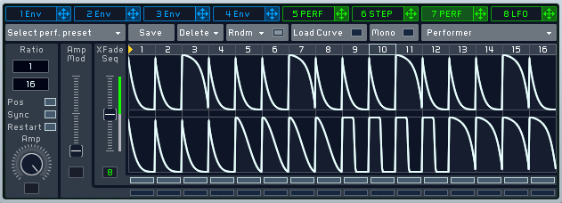

The _Xfade Seq_ slider controls which of the two patterns we're hearing. The Stepper itself now plays 16th notes. In order to switch between the lanes, whatever's doing the switching needs to have a total period of 32 16th notes - 16 for the first pattern, 16 for the second.

LFOs are __bipolar__ modulation sources. This means that _XFade Seq_ needs to be set in the center.

The LFO itself can be set up like this:

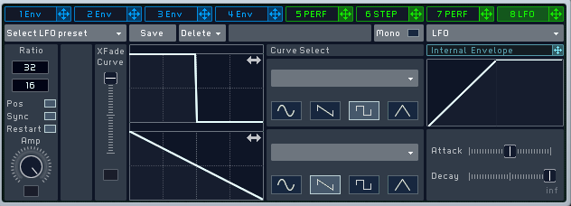

The square wave means that it first sets the _XFade Seq_ to its maximum, then to its minimum. Since LFOs can crossfade between shapes as well, 
it's important to set the _XFade Curve_ to the maximum - so that you only get a square wave, not a square wave mixed with a saw.

The math confirms: a ratio of 32 16th note steps gives us a nice switch. Of course, this is just a fraction - so instead of 32 16 in the ratio, 
we can choose 2 over 1 as well. 16 16th notes are after all equal to 1 whole note.

## 64-step Patterns

What's better than 32 steps? 64 steps! The trick with the LFO can also be applied between two Performers. To achieve this, we'll use an LFO
with a ratio of 4 over 1 and a square wave shape again. This time, we'll modulate the Amp of the Performer.

Both Performers then look like this:

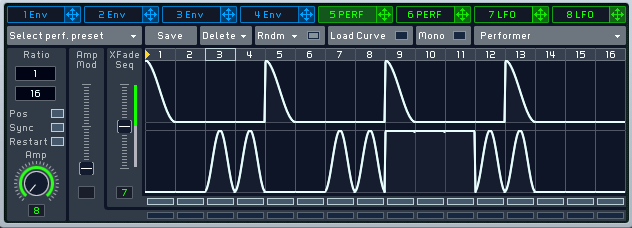

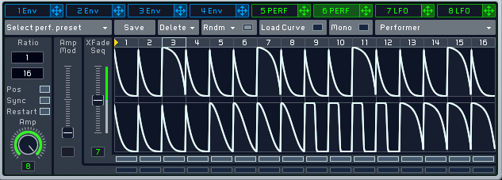

The difference is perhaps subtle; but you can see that the first Performer's _Amp_ knob is set to zero. The LFO pushes it to its maximum value.
The second Performer's _Amp_ knob is set to the maximum; the same LFO then pushes it to its minimum.

Since all of this is getting pretty complex, [here's a patch](v1.5.5/64StepPattern.nmsv).
