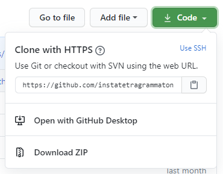

# About

This repository contains patches for various software synthesizers. Often, these are remakes - clean-room reverse engineered - of the sounds you can hear in popular music. Others have a more academical approach - to teach or explain certain concepts.

I am not a fan of "studio secrets". I have been fortunate enough to learn from many people at no cost; it is only fitting that I return the favor for others, keeping the threshold as low as possible for everyone.

# How am I supposed to use this?

There are three options:

## Download all of it as a single ZIP file.

This part of the Github interface may have changed a bit since it was taken. However, the concept is always the same: click the green button and download everything as a single ZIP.

## Download only the patch that you want.

Let's say you made a request and I've directed you to the "overview" folder. I don't link to patches directly because that's a bit messy and hard to maintain.
Let's take this folder as an example: https://github.com/instatetragrammaton/Patches/tree/master/Vember%20Audio%20Surge/v1.6.6/NES

Click the filename and you'll see a "download" button. Alternatively, the "view raw" link may also work for you.

## Get everything and keep it up to date.

This is the least easy to set up but the most rewarding. **Note**: You will need a Github account to use this.

* First, get Github Desktop here: https://desktop.github.com/
* Install the software.
* Choose "Clone a repository from github.com"
* Choose the "URL" tab and fill out https://github.com/instatetragrammaton/Patches (or just instatetragrammaton/Patches)
* Pick the location on your harddisk where you want to store it.

That's it! You don't get notifications every time I add a patch (too bad) but all you have to do in Github Desktop is do Repository > Pull - and it'll update everything! I add patches occasionally (see "Do you also take requests?"), so don't expect a full stream of new content every day, but perhaps you'll find something you like in a request :)

# Do you also take requests?

Yes! Go to https://www.reddit.com/r/synthrecipes/ and ask and there's a good chance I respond; that's where a lot of these patches also originate from.

# Versions

The subfolders denote the minimal version number that patches will run on. I will try to keep as many patches compatible with official 
releases, i.e. not any random beta.

# License

 This work is licensed under a <a rel="license" href="http://creativecommons.org/licenses/by/4.0/">Creative Commons Attribution 4.0 International License</a>.

tl,dr: you are free to use these patches, and attribution is very much appreciated, as is leaving the author's name intact - either in the metadata of the patch itself, or in the filename.

# Disclaimer

All patches are supplied as-is. All patches have been built from scratch. There are no patches in this repository from any commercially available soundsets. Some patches require additional samples to work. In most cases, they are not part of the patch itself; they have to be loaded separately. To keep everything coherent, they're wrapped in a ZIP file.

Any references to equipment, songs, artists, videogames or other media are solely used for illustration. The trademarks and copyright are property of their respective owners.
