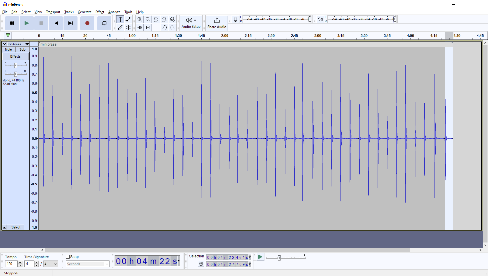
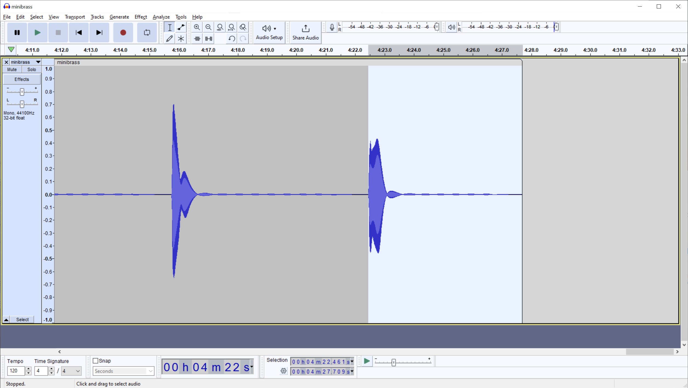
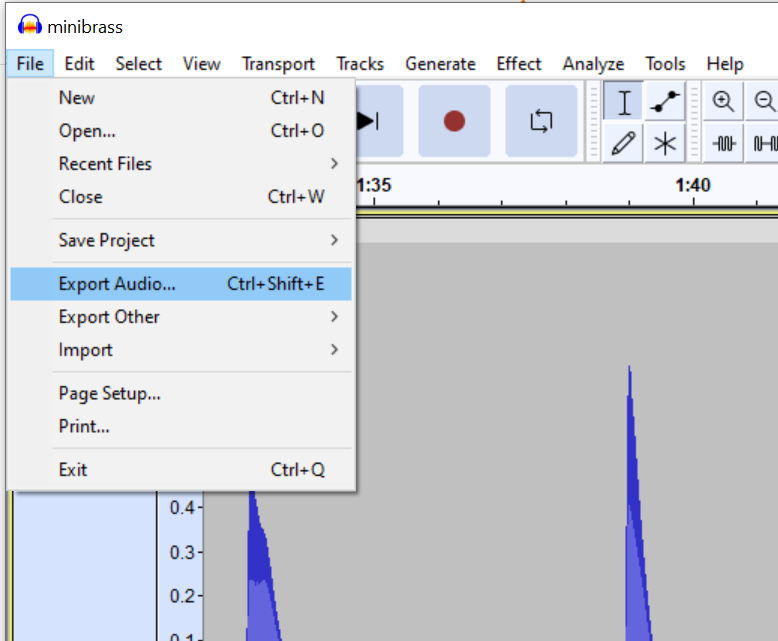
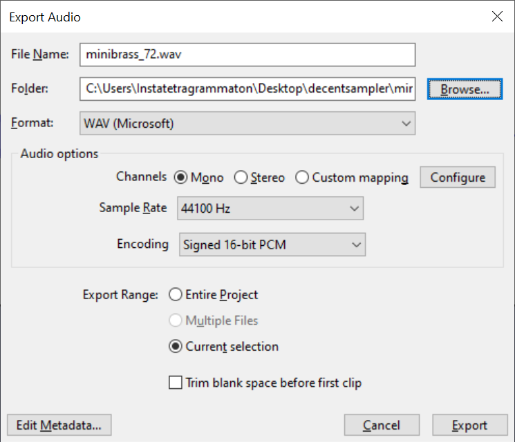

# Introduction

DecentSampler is a free multi-platform plugin and standalone piece of software that allows you to create sample-based instruments. It requires some effort to get things going, but once you've got the hang of it you can 
create nice self-contained sample libraries that are preferable to SoundFonts.

While the documentation is extensive, it can still be daunting to create something - especially if you've never written code. This guide is intended for that audience.

# Preparing the samples

The first part of the work consists of preparing the samples themselves. For this, we can use [Audacity](https://www.audacityteam.org/).

If we open the recording in Audacity, it may look like this:

Each of the 44 notes of the Minimoog were recorded and held for a few seconds to capture the full sound. Since the Minimoog is monaural, this was a monaural sample.

## Naming

The following diagram shows the keyboard of a Minimoog.

To make sampling easier, giving each sample a consistent name can prevent confusion. Since most file managers in operating systems sort alphabetically/numerically, using the regular musical note names would not result in an easy overview.

To make things easier, we can use the [MIDI note numbers](https://www.inspiredacoustics.com/en/MIDI_note_numbers_and_center_frequencies).

We can start with the last note of the recording and select only the part of the file that contains that particular note.

Then, we must save that selection as a `.wav` file. To do this, go to File > Export.

Then, in the dialog, fill in the following:

The name is `minibrass_60.wav`. The 60 denotes the MIDI note number - C4 (middle C). The `minibrass_` part will of course vary by sound; it might've been called `dx7piano` instead. Whatever name you choose, be consistent.

(to be continued)
