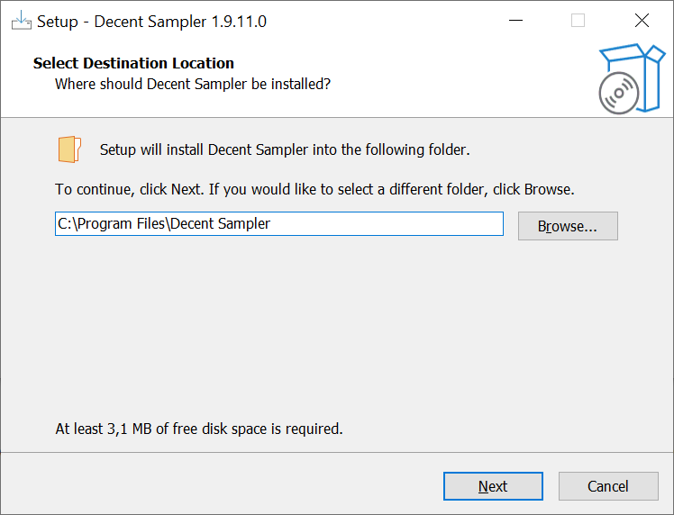
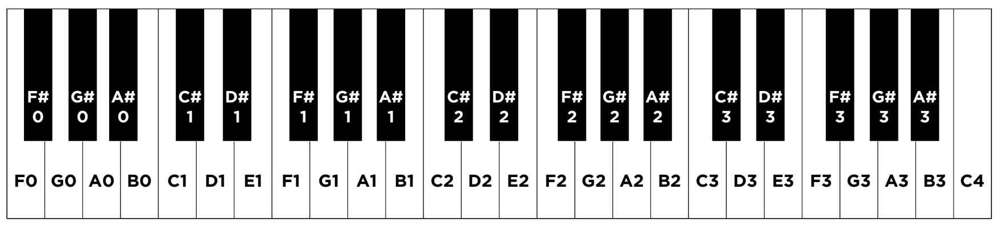

# Introduction

DecentSampler is a free multi-platform plugin and standalone piece of software that allows you to create sample-based instruments. It requires some effort to get things going, but once you've got the hang of it you can 
create nice self-contained sample libraries that are preferable to SoundFonts.

While the documentation is [extensive](https://www.decentsamples.com/docs/format-documentation.html), it can still be daunting to create something - especially if you've never written code. This guide is intended for that audience.

# Installing the software

Download the plugin here: https://www.decentsamples.com/product/decent-sampler-plugin/

Follow the installation instructions. On Windows, three locations are needed:

* one for the standalone application
* one for the 32-bits plugin
* one for the 64-bits plugin

The standalone application can just be installed in your `Program Files` folder.



For the plugins: personally I've always set up my DAW so that there are two folders: `C:\VST32` and `C:\VST64`. This means that I always must specify a custom VST2 plugin location, but as a result, there's only a single folder that all my VST2 plugins reside in. It's also less effort to type.

If you only wish to create sample libraries, all you need is the standalone version.


Let's start the application to set up some basics.


One part of this consists of setting up an account. Don't worry - nothing needs to be purchased. Fill in your email address and password and continue.

## Library Setup

After creating the account, the software asks where the library needs to be set up. This can be changed later if needed in File > Preferences. For now, I've just created a folder on the desktop called "decentsampler".


The full location is thus `C:\Users\Instatetragrammaton\Desktop\decentsampler`.

For Windows-based desktop DAWs, I would recommend a separate drive for the OS/applications and a separate drive for sample libraries. This lets you choose a smaller, faster drive (for instance 512 GB) for OS duties and a bigger, slower drive (for instance 4 TB) for samples. If we assume that you have such a setup and you solely use your computer for music production, then `D:\DecentSampler` is a fine location, too.

Additionally, if you must wipe and reinstall Windows, all you need is to reinstall the software - not the libraries. For big libraries such as [Native Instruments Komplete](https://www.native-instruments.com/en/catalog/software/), this can save a lot of time. 

## Audio Setup

For the [standalone version](https://github.com/instatetragrammaton/Patches/blob/master/Musings/Plugin-Host.md#standalone-plugins) it's necessary to set up audio. Go to Options > Audio MIDI Settings


There, choose your audio interface and preferred settings. These should be similar to those of your DAW. During standalone mode, this also means you can't use your DAW, as DecentSampler is already using the interface.


Once this is done we can close DecentSampler for a while.

# Preparing the samples

Making a sample library truly starts with recording the sounds that we want to use. For this practical example, I've recorded a Minimoog brass sound. I've played each of the 44 keys, one by one, holding the note for a while to capture the full duration. All of this was recorded as one big .aif file.

The first part of the work consists of preparing the samples themselves. For this, we can use [Audacity](https://www.audacityteam.org/). If we open the recording in Audacity, it may look like this:


Since the Minimoog is monaural, this was also a monaural sample.

Since `C:\Users\Instatetragrammaton\Desktop\decentsampler` is the location of our library, I've created a new folder for this sound called `minibrass`. 
I've saved the `minibrass.aif` file in this folder. 

**This will be our starting point.**

## Naming

To make sampling easier, giving each sample a consistent name can prevent confusion. Since most file managers in operating systems sort alphabetically/numerically, using the regular musical note names would not result in an easy overview, since files would be sorted like this:

```
minimoog_a0.wav
minimoog_a1.wav
minimoog_a2.wav
minimoog_a3.wav
minimoog_b1.wav
minimoog_b2.wav
(etc)
```

The following diagram shows the keyboard of a Minimoog.



We can translate the notes to MIDI note numbers using the following chart:

| Octave | C  | C#/Db | D  | D#/Eb | E   | F   | F#/Gb | G   | G#/Ab |
|--------|----|-------|----|-------|-----|-----|-------|-----|-------|
| -1     | 0  | 1     | 2  | 3     | 4   | 5   | 6     | 7   | 8     |
| -1     | 12 | 13    | 14 | 15    | 16  | 17  | 18    | 19  | 20    |
| 0      | 24 | 25    | 26 | 27    | 28  | 29  | 30    | 31  | 32    |
| 1      | 36 | 37    | 38 | 39    | 40  | 41  | 42    | 43  | 44    |
| 2      | 48 | 49    | 50 | 51    | 52  | 53  | 54    | 55  | 56    |
| 3      | 60 | 61    | 62 | 63    | 64  | 65  | 66    | 67  | 68    |
| 4      | 72 | 73    | 74 | 75    | 76  | 77  | 78    | 79  | 80    |
| 5      | 84 | 85    | 86 | 87    | 88  | 89  | 90    | 91  | 92    |
| 6      | 96 | 97    | 98 | 99    | 100 | 101 | 102   | 103 | 104   |

We can start with the last note of the recording and select only the part of the file that contains that particular note. That note - C4 - would correspond to MIDI note number 72.

There is a competing standard that differs by an octave - so here, C4 is 60, not 72. Since this table is the standard that most MIDI keyboards implement (and also the one that DecentSampler uses), we're using that as a guideline.


Then, we must save that selection as a `.wav` file. To do this, go to File > Export.


Then, in the dialog, fill in the following:


The name is `minibrass_72.wav`.

Whatever name you choose, be consistent. A format of `name_articulation_note_velocity` offers sufficient flexibility; if necessary, `articulation` can just be part of the folder name itself.

When this process is finished, there should be 44 samples of (nearly) equal size in the folder, named `minibrass_29.wav` (F0) to `minibrass_72.wav` (C4).

# Creating the sample program

When these sounds need to be loaded in DecentSampler, the software needs to know which sample needs to be played for which key. To do this, we need to create a new file. This file contains an exact description that DecentSampler understands.

While this file can be created with Notepad, doing this with an editor works better.

## VS Code

For editing purposes, VS Code is a suitable pick. [Install the latest version](https://code.visualstudio.com/).

On starting VS Code, you'll see something like this:


To create a project, we need to tell VS Code where it's located. Go to File > Open Folder, and choose the folder where you have stored the `.wav` files.


In our case, that's `C:\Users\Instatetragrammaton\Desktop\decentsampler\minibrass`.


VS Code will ask if you trust this folder. Yes - we do, we've just created it and it doesn't contain anything but the .wav files yet.

## Syntax highlighting

We must do one more thing to make VS Code earn its keep. The file type that DecentSampler uses is called a `.dspreset` file. This is an XML-file with a different extension. XML files are text, but special characters are added to make it easier for a computer to understand.

VS Code can use [syntax highlighting](https://en.wikipedia.org/wiki/Syntax_highlighting) to make the file more readable, but for that to work we must tell it what kind of file this is.

First, go to File > Preferences > Settings:


Then, search for "associations".


Click "Add Item", and create a mapping by filling out `*.dspreset` in the Item box, and `xml` in the value.


This tells VS Code that all files that have the `.dspreset` extension are in fact really just XML files.

## Creating a `.dspreset` file

Now, we can create our first `.dspreset` file. Click "Create new file".


Call the file `minibrass.dspreset`.


Again, note how the folder has the same name as this file, which is also the start of the name of each .wav file. This consistency makes searching for things really easy.

When the file is created, it's still empty. Let's put something in there. Copy the code that's shown here:

```xml
<?xml version="1.0" encoding="UTF-8"?>
<DecentSampler minVersion="1.0.0">
  <ui width="812" height="375" layoutMode="relative" bgMode="top_left">
    <tab name="main">
      <labeled-knob x="445" y="75" width="90" textSize="16" textColor="AA000000" 
                    trackForegroundColor="CC000000" trackBackgroundColor="66999999" 
                    label="Attack" type="float" minValue="0.0" maxValue="4.0" value="0.01" >
        <binding type="amp" level="instrument" position="0" parameter="ENV_ATTACK" />
      </labeled-knob>
      <labeled-knob x="515" y="75" width="90" textSize="16" textColor="AA000000" 
                    trackForegroundColor="CC000000" trackBackgroundColor="66999999" 
                    label="Release" type="float" minValue="0.0" maxValue="20.0" value="1" >
        <binding type="amp" level="instrument" position="0" parameter="ENV_RELEASE" />
      </labeled-knob>
      <labeled-knob x="585" y="75" width="90" textSize="16" textColor="AA000000" 
                    trackForegroundColor="CC000000" trackBackgroundColor="66999999" 
                    label="Chorus" type="float" minValue="0.0" maxValue="1" value="0" >
        <binding type="effect" level="instrument" position="1" parameter="FX_MIX" />
      </labeled-knob>
      <labeled-knob x="655" y="75" width="90" textSize="16" textColor="FF000000"
                    trackForegroundColor="CC000000" trackBackgroundColor="66999999"
                    label="Tone" type="float" minValue="0" maxValue="1" value="1">
        <binding type="effect" level="instrument" position="0" parameter="FX_FILTER_FREQUENCY"
                 translation="table" 
                 translationTable="0,33;0.3,150;0.4,450;0.5,1100;0.7,4100;0.9,11000;1.0001,22000"/>
      </labeled-knob>
      <labeled-knob x="725" y="75" width="90" textSize="16" textColor="AA000000" 
                    trackForegroundColor="CC000000" trackBackgroundColor="66999999" 
                    label="Reverb" type="percent" minValue="0" maxValue="100" 
                    textColor="FF000000" value="50">
        <binding type="effect" level="instrument" position="2" 
                 parameter="FX_REVERB_WET_LEVEL" translation="linear" 
                 translationOutputMin="0" translationOutputMax="1" />
      </labeled-knob>
    </tab>
  </ui>
  <groups attack="0.000" decay="25" sustain="1.0" release="0.430" volume="-3dB">
    <group>
      <!-- HERE WE CAN PUT OUR SAMPLES -->
      <sample loNote="60" hiNote="60" rootNote="60" path="minibrass_60.wav"/>
    </group>
  </groups>
  <effects>
    <effect type="lowpass" frequency="22000.0"/>
    <effect type="chorus"  mix="0.0" modDepth="0.2" modRate="0.2" />
    <effect type="reverb" wetLevel="0.5"/>
  </effects>
  <midi>
    <!-- This causes MIDI CC 1 to control the 4th knob (cutoff) -->
    <cc number="1">
      <binding level="ui" type="control" parameter="VALUE" position="3" translation="linear" translationOutputMin="0" translationOutputMax="1" />
    </cc>
  </midi>
</DecentSampler>
```

The contents are based on the boilerplate file shown here: https://www.decentsamples.com/docs/format-documentation.html#appendix-c-boilerplate-dspreset-file , but have been stripped down a bit.

**WARNING:** When you copy this code, make sure that it starts at the first line, like this:


_not_ like this:


Next to the name is a little white circle. This means you have not saved the file yet. Do File > Save (Ctrl+S) to save the changes.

## Testing our `.dspreset` file

Let's open DecentSampler. By default, it starts with a blank slate. Go to File > Load and navigate to our `C:\Users\Instatetragrammaton\Desktop\decentsampler\minibrass` folder. The .dspreset file should be in there (if it's not or if you get an error, you might've forgotten to save it).

The result is this:


