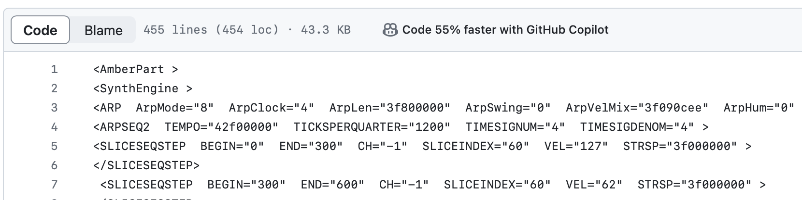
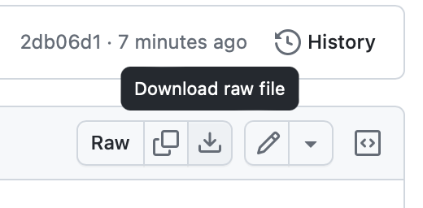

# What it is

This plugin needs no introduction. It's a huge library (over 9000 presets) of great sounds, mainly used for soundtrack work, and it's one of the most expensive plugins you can get that is not a bundle.

The founder of Spectrasonics is Eric Persing, who has decades of experience designing patches for Roland. Diego Stocco is another great talent who has an unorthodox and fascinating approach to creating sounds.

# Where to get it

https://www.spectrasonics.net/products/omnisphere/

# How to download

Since Omnisphere presets are text files, Github will helpfully try to show something like this:

The solution is to click the "Download RAW" button here:

In Omnisphere, you can navigate to the STEAM/Omnisphere/Settings Library/Patches/User folder and create a folder in there that you'd like to use as category name (for instance, Leads). Then, copy the .prt_omn file in there. See also https://support.spectrasonics.net/manual/Omnisphere2/25/en/topic/loading-third-party-libraries . 
