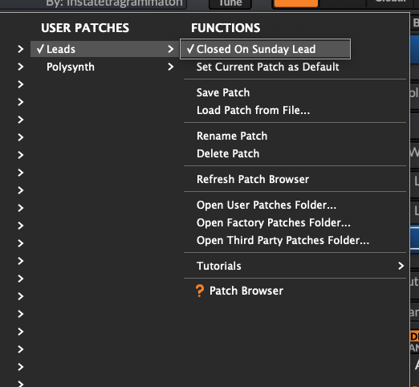

# Where to get (it's free!)

https://surge-synthesizer.github.io/

# Downloading single patches

Github tries to make sense of the .fxp files and helpfully shows them as a huge text file with a single line. This is of course not the way to go.\

To download a single patch, click the "Raw" button on the righthand side of the screen.

This should prompt most browsers to just download the .fxp file. Once you have that, continue reading.

# How to load presets

* Click on the "Menu" button in the bottom left of the plugin window
* Navigate to "Data and Patches" > "Open User Data Folder"

* If there's no folder in there yet, create one first. For instance, if the sound you downloaded is a bass sound, create a new folder called "Bass"

**Important:** Surge uses folder names as categories! If there are no categories, Surge will not be able to find the sounds!

* Then, copy the `.fxp` file into that folder that you just created

Then:
* click on the "Menu" button again
* Navigate to "Data and Patches" and choose "Rescan all data folders"

Alternatively, if the instance of Surge is removed from the track and then loaded again, the patch folder will have been updated as well.

Just click on the "Patch Browser" window to choose from the list. Any newly created categories will show up in a dropdown menu in the bottom.

# It doesn't work! Help!

## It won't load my files!

First of all - `.fxp` is the generic name of a singular VST patch for a VST plugin. Serum, Surge and a variety of other synths all use files with the `.fxp` extension. Just because a patch has the `.fxp` file extension doesn't mean it can be loaded by Surge!

## Copying into the user folder doesn't work! The patch doesn't show up!

If the above doesn't work for you for whatever reason, try the following.

* Create a new track in your DAW
* Load up an instance of Surge
* By default, Surge starts with an initialized patch. This is a simple, unfiltered saw wave.
* Drag the "Shape" slider all the way to the right, like this:

This is just so that we have a different patch from the regular initialized patch.

* In the "Creator" field, just put your own (real or artist) name.
* The Category field is _not_ optional! Leave it at "Init" for now
* Save this patch by clicking "OK". 

The Patch Browser should now look like this:

Now, let's look at the contents of the User Data Folder.

As you can see, a new folder called `Init` has been added, and in that folder, there's a file called `Initialized Patch.fxp`

If you now copy a patch you have downloaded into this `Init` folder, it should show up after rescanning.

If rescanning has no effect:

* Delete the track and the instance of Surge
* Create a new track
* Load up an instance of Surge again

If you now open the Patch Browser, you should see a folder at the bottom called "Init" that contains the Initialized Patch that was just created.

This is the final "have you tried switching it off and on again?" option.

# About

Surge XT is the new and improved version of Surge. It's gained several new modulation possibilities and can even execute bits of code as modulation, which is a delightfully deep rabbit hole to get lost in.

All the existing Surge patches will still work, but to reflect the release of XT I decided to create a new folder.
