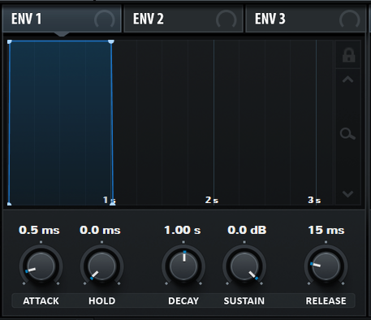
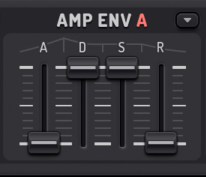
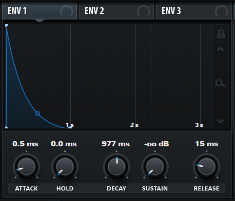
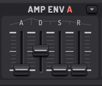
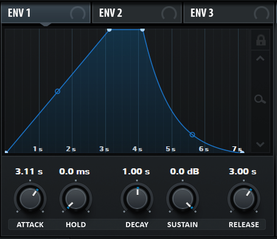

# Common Envelope Shapes

A useful shortcut for desiging sound is having a good grasp on common envelope shapes. In a lot of cases, a sound's character can be 
achieved quickly by knowing the right shape.

While the names of these are not standardized, I find them useful.

## Gate 

The Gate shape is very useful as a starting point. It reacts to the keyboard's "gate" signal (hence the name) which indicates whether a key is pressed or not.

As soon as the key is pressed, the signal is at full strength. As soon as it is released, it drops to zero again. The values for an ADSR-envelope are:

* Attack: 0
* Decay: maximum
* Sustain: maximum
* Release: 0

The decay value in this case is irrelevant, since Decay is the time required to go from the final value of the Attack to the Sustain. Since these are equal, changing the Decay has no effect.

If the envelope is controlled by means of sliders, putting the Decay at its maximum gives a somewhat visual representation of the curve:

Generally speaking, organs (tonewheel or transistor) have a Gate shape. This does not require complex circuitry, which means that you don't have to create an envelope generator per note you wish to control.

If the Attack of the Gate envelope is increased a bit, it becomes useful for emulating synth brass - especially when combined with a pluck shape (with a slightly increased Attack) for the filter envelope.

## Pluck

The Pluck shape is incredibly common. As it name suggests, it simulates the plucking of a string - it starts out at full force, then decays relatively quickly.

Visually, it looks like this:

Generally, in numbers the values for an ADSR envelope are:

* Attack: 0
* Decay: 50%
* Sustain: 0
* Release: 0

Or using sliders, like this:

Again, notice how the sliders give a somewhat visual representation as well.

The 50% number makes the difference between a long and a short pluck. Not all synthesizers will use the same value for the decay; so setting it to 50% in Serum results in a decay of 1 second, but in other synths it may be more or less than that. Still, halfway is a nice starting point.

## Pad

The Pad shape is the same as the Gate shape, but merely with a longer attack and release. It is derived from an ensemble of instruments that can play a crescendo or decrescendo - a long fade-in and a long fade-out, so it's also useful for emulating real acoustic instruments, like strings.

While the times of 3 seconds for attack and release are arbitrary (longer is always allowed!) it's still useful as a rule of thumb.

Generally, in numbers the values for an ADSR envelope are:

* Attack: 50-75%
* Decay: maximum
* Sustain: maximum
* Release: 50-75%
