# Mastering Modulation

An important part of learning any form of synthesis is understanding how _modulation_ works.

Conventional synthesizers tend to simplify modulation; modular synthesizers make it explicit. The principle in either case is the same - and learning it the modular way gives you a huge advantage when you're trying to understand what's happening in a sound.

However, for that we need to get a bit more abstract, first.

## Aspects

Modulation has the following aspects:

- _source_ - what is doing the modulation?
- _target_ - what is being modulated?
- _amount_ - how much is something being modulated?
- _polarity_ - is it only going in one direction, or in both?

Let's touch on each of these with some simple examples.

Here's a volume dial of a car stereo.

If you turn the dial clockwise, the volume goes up. If you turn it counterclockwise, the volume goes down. If you're doing this, you are now _modulating_ the volume.

Turning the dial does not make a sound by itself, but you're changing a _property_ of a sound - in this case the volume of the radio signal.

Summarized:

- the modulation _source_ is your hand.
- the modulation _target_ is the radio's volume.
- the modulation _amount_ is how much you turn the dial up or down.

### Polarity

_Polarity_ can be explained with where you start. Here's a slider that ranges from zero to ten. Let's say this is a volume slider.

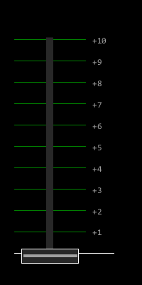

When the slider is all the way down, the value is zero. When it's turned all the way up, it's 100%. If you start at zero and then turn it up, you've got unipolar modulation.

The next slider is for the pitch. If you put it in the _middle_ and then move it up, then down, then you're essentially performing _bipolar_ modulation.

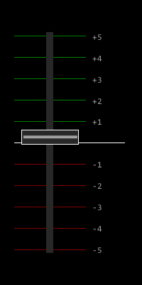

Of course, as a human, you will have a limited speed of modulation and accuracy. You'll also get tired eventually. If you were to replace yourself with a robot, you'd have your hands free for more important things.

Ultimately, that's what modulation is - **a robot that moves a slider for you**. This robot needs some instructions, though.

## Sampling theorem

Sound can be encoded as a series of numbers - samples. If you play back each sample at the correct time, you reconstruct the original sound. For sound, the sampling rate is fixed - i.e. every sample lasts for a fraction of a second, but the distance between each sample is identical.

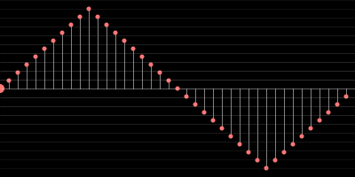

Since each sample is equidistant, we can just write down the number, instead of 0.00002267573 seconds, 0.00004535147 seconds and so on (assuming a sample rate of 44100 Hz).

The value depends on the headroom; for 16-bits audio, the number lies between 0 and 65536 (216). To simplify things, let's scale this value down to something between 0 and 1.

If we write down the value of each sample in a table, it would look something like this:

| Sample | Value |
| ------ | ----- |
| 0      | 0.0   |
| 1      | 0.1   |
| 2      | 0.2   |
| 3      | 0.3   |
| 4      | 0.4   |
| 5      | 0.5   |
| 6      | 0.6   |
| 7      | 0.7   |
| 8      | 0.8   |
| 9      | 0.9   |
| 10     | 1.0   |
| 11     | 0.9   |
| 12     | 0.8   |
| 13     | 0.7   |

(and so on)

For modulation, the values can also be encoded as numbers. The above graph could contain the samples for a triangle waveform, or the instructions for our little robot on when a slider should be moved to a certain position.

The interesting thing is that it does not matter if these values are binary numbers or continuous voltages; but now that we have numbers, we can start treating a synthesizer as an analog computer.

## Arithmetic

_"But wait - *analog* computers? Aren't computers digital?"_

These days? Yes. However, analog computers have been used throughout history, however - the most famous example being that of a [slide rule](https://en.wikipedia.org/wiki/Slide_rule).

To explain this, we can start with a _mechanical_ computer.

Let's show a very simple mechanical computer - one that can calculate the sine of an angle.

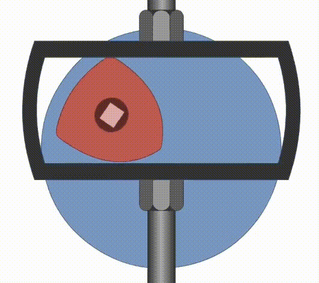

> [Source](https://www.youtube.com/watch?v=PQaaJSAm1UM)

With this, you could "compute" this by moving the triangular shape to the correct angle. When it's at 3 o' clock, the angle is zero degrees, and `sin(0)` is 0. When it's at 12 o' clock, the angle is 90 degrees, and `sin(90)` is 1. By applying the correct markings, it would be possible to find out the sine of any angle really quickly - just turn and read.

Of course, it's clear that this computer is not perfectly precise - a true sinewave does not really "stop", but this mechanism does. The parts could also have wear and tear, resulting in lower accuracy, but it shows that it is absolutely possible.

## Operations

Calculating the sine of an angle is pretty advanced - so let's do something more simple. In most cases, when you're dealing with modulation, the type of operations you'll perform are generally:

- addition
- multiplication
- division
- subtraction

The screenshots shown are from [VCV Rack](https://vcvrack.com). The principles shown work on a lot of (software) synthesizers - so don't let the cables intimidate you.

### Addition

The first operation is probably the most elementary: addition. Addition (or summing) is achieved by mixing two signals together. Essentially, a mixer is an analog computer that can perform addition of numbers.

Here, the signals are two sinewaves shown in red and yellow. The pitch of the yellow VCO is twice as high as that of the first.

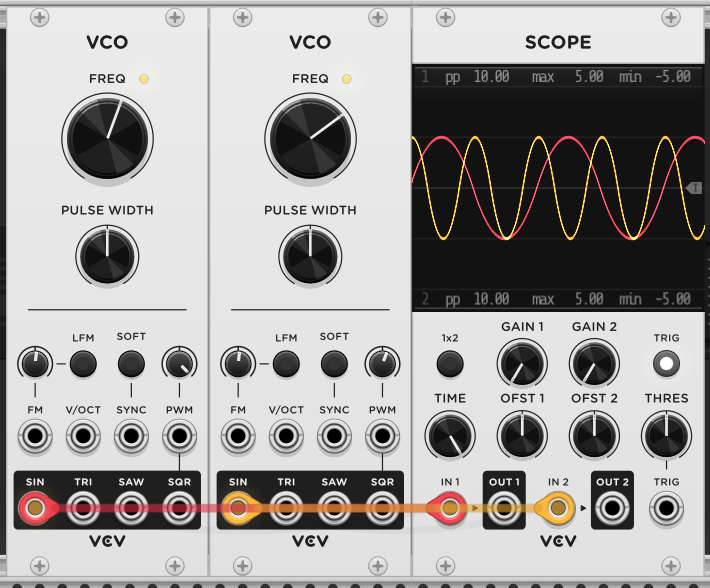

If we add these two signals together, the result looks as follows.

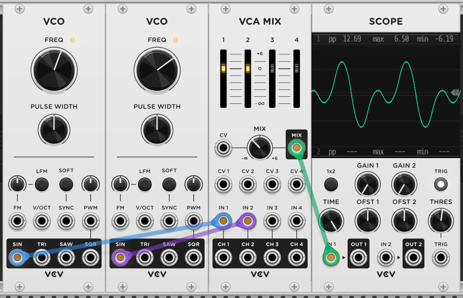

So, what is happening here in mathematical terms? We have two waveforms - `sin(x)` and `sin(2x)` and we add them together. That's it!

In this case, our mixer can sum 4 numbers together. To add more numbers, we can choose a bigger mixer - or we can connect two mixers. The [commutative property](https://en.wikipedia.org/wiki/Commutative_property) in mathematics that tells us that

`2 + 2 + 2 + 2`

is equal to 

`(2 + 2) + (2 + 2)`

In other words, having a single mixer with 8 inputs is identical to having two mixers each with 4 inputs which are then mixed together.

In mathematics, you can add any two numbers - no matter how big or small. In practice, mixers do not sum perfectly - and the numbers supplied to them can not be infinite.

### Multiplication

Multiplication is achieved by amplifying signals. By amplifying with a number greater than one, you're performing multiplication. This is also referred to as "increasing the gain" of a signal. A gain knob is an analog computer that can multiply incoming numbers.

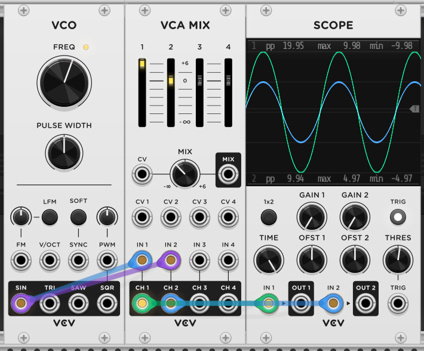

Here, the oscilloscope is showing two signals. Green is the same signal as blue, but in this case, the VCA mix slider of green is moved up.

### Division

Division is achieved by amplifying signals - but with a number between zero and one. This is also referred to as "attenuating" a signal. In mathematics, multiplying by a half is the same as dividing by two. An attenuator is an analog computer that can divide incoming numbers.

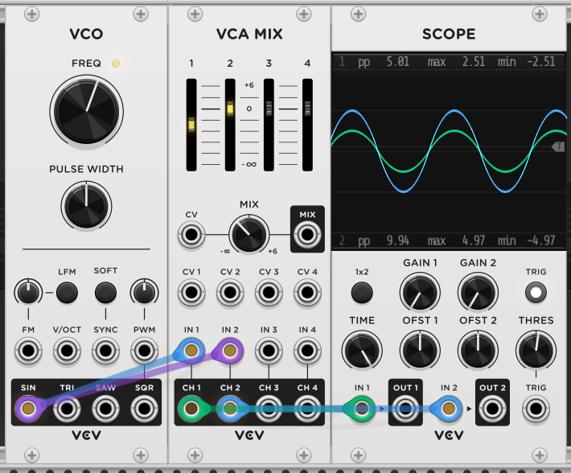

Here, the oscilloscope is showing the same two signals - but the VCA mix slider of green is moved down.

### Scale

The scale of the VCA mix shows +6, 0 and -∞ (minus infinity). When performing multiplication with plain numbers, you'd expect something like 4 * 2 = 8.

In audio, the 0 indicates "unity gain" - in other words, multiplying by one. The -∞ is effectively "multiply by zero" - the signal falls completely silent. The +6 is a reference to VU meters which indicate a measurement in decibels (dB). As a rule of thumb, +3dB is twice as loud, and +6dB is four times as loud. So, in the first example, even if visually it seems that the green waveform is twice as high as the blue one, it's actually four times as loud.

As you can see, the scale from 0 to -∞ is bigger than that of 0 to +6. This makes it look like the slider is rather aimed at division instead of multiplication - and in general, that's how you work with audio signals. You start with something loud and then you reduce the volume. If it's not loud enough, you put a multiplier in front of it (gain) and then reduce it again.

The reason for this is headroom. A speaker cone can only move outwards to a certain number - so every audio signal it reproduces must be under that number.

### Subtraction

A mixer can only add signals together - so in order for subtraction to work, we must first do something else.

The first encounter with arithmetic often consists of counting something. "You have five apples. You take two apples away. How many apples are left?"

The problem with counting things is that it does not deal well with negative numbers - and those are what we need to perform subtraction. A more effective way of visualizing this is by using vectors. A vector is an arrow that points in a certain direction - and by putting them end-to-end, you can perform arithmetic.

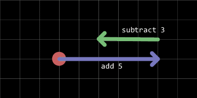

This allows us to deal with negative numbers more easily; adding and subtracting is now a matter of moving to the right or to the left from the starting point.

To make a vector point to the opposite side, we can multiply it with minus 1. For audio, this is also called *inversion*.

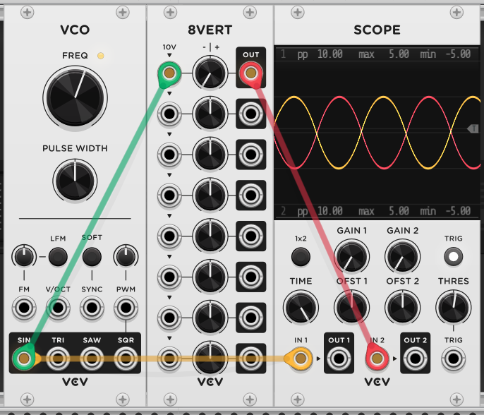

As you can see, the yellow sinewave is the exact opposite of the red one. If you were to sum these waveforms, the end result would be nothing - silence. They cancel eachother out.

 For this to happen, the signal is run through an inverter. As the screenshot also shows, the functionality of inversion and attenuation can be combined - because it's often very convenient to have both. In other words, the 8VERT is an analog computer that allows incoming numbers to be multiplied by a number between -1 and +1.

### Bipolar to Unipolar

Consider the following set of modulation values that are used to modulate an oscillator's core pitch as a number of semitones.

|     |   |   |   |   |   |   |   |   |
|-----|---|---|---|---|---|---|---|---|
|Step | 1 | 2 | 3 | 4 | 5 | 6 | 7 | 8 |
|Value| -6| -6| -6| -6| +6| +6| +6| +6|

The lowest value is -6; the highest value is 6. It would be safe to assume that this is a bipolar modulation source with the center at 0. Playing a middle C results in hearing an F# alternating between octaves.

However, with some arithmetic, we can make it unipolar; all we have to do is to add 6 to every number. The result is then this:

|     |   |   |   |   |   |   |   |   |
|-----|---|---|---|---|---|---|---|---|
|Step | 1 | 2 | 3 | 4 | 5 | 6 | 7 | 8 |
|Value| 0 | 0 | 0 | 0 |+12|+12|+12|+12|

This is far more usable; we now have an LFO that alternates between the root key pitch and an octave higher.

On a non-modular synthesizer, this could be achieved by simply turning up the pitch of the oscillator itself 6 semitones. On a modular synthesizer, there are a variety of techniques to achieve this, from adding a step sequencer outputting the same voltage to using "analog memory" - i.e. a set of potentiometers that control an output voltage.

## Robots

Now that we know that:

- modulation generates numbers
- numbers can be used in computation

let's see how this applies to synthesizers.

We already knew that modulation is a robot that moves a slider for you. There are various types of robots - which can also be called *modulation sources*.

### Static

At the start, I mentioned the volume dial; the dial itself is a robot, albeit one that does not move on its own. It keeps sending the same number - which depends on its position. This number must always be taken into account when performing arithmetic!

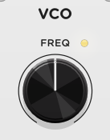

### Initial

An example of an initial modulation source is keyboard velocity. You press a key with a certain force; as a result, a value is picked - and this value is held until the next time.

### Momentary

Some modulation sources - often "physical" sources such as pressure - will automatically return to zero when no longer pushed or held. A spring-loaded pitch bend wheel is an example of this, as is aftertouch.

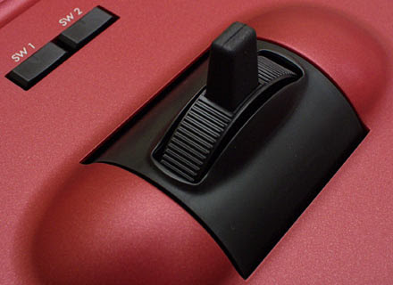

### Step sequencer

A step sequencer consists of a set of static modulation sources - each getting picked in turn to send its value to a modulation target.

### Keytracking

An example of how synthesizers may simplify modulation is that you take for granted that playing notes higher up the keyboard results in a higher pitch.

This is achieved by the keytracking modulation source.

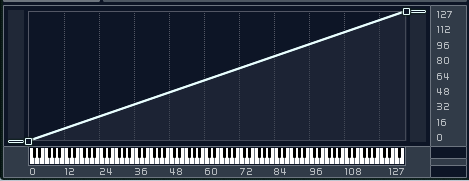

Keytracking sends a number that depends on the position of the key. In the above image, the keytracking is linear, positive and 100%. It's linear because the number increases constantly with each key; it's positive because higher keys correspond with a higher value, and it's 100% because the value is at its minimum at the beginning of the keyboard and its maximum at the end of it.

### LFO

In general, an LFO keeps doing its job continuously, regardless of what happens in the background. That said, some LFOs can be triggered - i.e. they start running their cycle when they receive a signal, such as pressing a key on the keyboard. In general, LFOs are bipolar modulation sources.

### Envelope

In general, an envelope only starts doing something when it receives a signal - such as pressing a key on the keyboard. That said, some envelopes are loopable - i.e. at the end of their cycle they restart again. In general, envelopes are unipolar modulation sources.

## Substitution

The fact that an envelope can be loopable and an LFO can be triggered - and a step sequencer can loop as well - implies that these sources can substitute for each other.

Let's take our set of values again.

|     |   |   |   |   |   |   |   |   |
|-----|---|---|---|---|---|---|---|---|
|Step | 1 | 2 | 3 | 4 | 5 | 6 | 7 | 8 |
|Value| 0 | 0 | 0 | 0 |+12|+12|+12|+12|

Without more information, this can be either:

- an 8-step sequencer
- a square wave LFO
- an envelope with a delay stage

Ultimately, all of these can generate exactly the same output, but each offers advantages and drawbacks. For instance, a step sequencer can generate arbitrary waveforms (up to a certain point). An LFO would be more affordable (if implemented in hardware) and easier to program. 

## Modulation in practice

