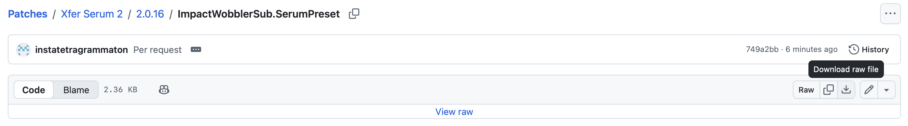
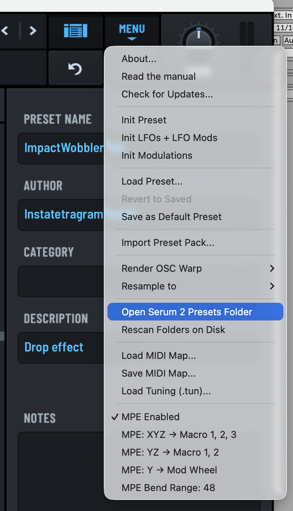

# Where to buy

https://xferrecords.com/products/serum-2

Serum 2 is free for Serum 1 owners, which is incredibly generous.

# About

Serum 2 improves on nearly everything I can think of that eventually started bothering me in version 1 - no true parallel filters, only two oscillators and a sub - 
and adds a whole bunch of new features that are again love letters to some amazing software.

The spectral oscillator clearly takes cues from the late Izotope Iris, so it's a joy to see that this has been included for further, deeper sound design.

The LFOs still only go to 100 Hz, but since there are now three oscillators, more creative FM can be achieved in that way.

# How to download

Click on the name of the preset. Then, click "Download raw preset".

.

In Serum, click the "Menu" button, then "Open Serum 2 Presets Folder". 

.

Locate the folder called "Presets" and open it; then locate the folder called "User" and open it. Copy the preset in there and it should show up in Serum.
