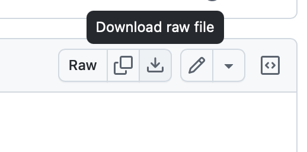

# Where to get it

https://u-he.com/products/repro/

# About

If Diva sounds analog, then Repro sounds even more analog. It's really amazing - and it's not exactly gentle for your CPU, but the sounds from this and the effects are enchanting. 
Still a standard bearer in analog emulation.

# Usage

The number of the folder (e.g. 16797) indicates the revision/build number. Instead of versioning like 1.0, 1.1 etc. this build number is probably a more reliable communicator of (in)compatibility.

Since these are effectively text files and Github loves to display text files, use the "Download raw file" icon when looking at the preset to get the proper version.

# After downloading

Once you've downloaded the file and it's got the right extension, open Repro-5, navigate to the "Presets", right click on "User" and choose "Open in Finder" (or in Windows, "Open in Explorer").

Then, copy the .h2p file you downloaded into that folder. Or create a new one, whatever you like.
