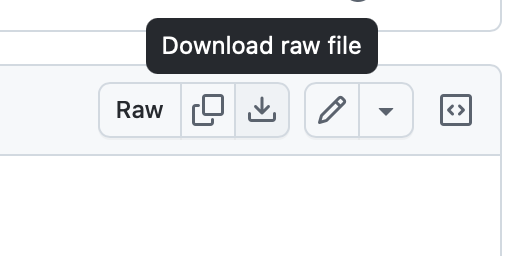

# Where to get it

https://u-he.com

# About

While I have several u-he products (Diva, ACE, Repro), I never had their flagship plugin, Zebra 2. Zebra 3, the long-anticipated follow-up, took 12 years to develop. 

> **At the time of writing it's still in public beta.**
> (I hope the patches stay compatible)
>
> Get your copy here: https://www.kvraudio.com/forum/viewtopic.php?t=625544
>
> If you decide to buy it, you don't need to reinstall anything; what you downloaded will just work.

It's a wavetable synth/additive synth, and 3 manages to add some more to the mix as well. It does not exactly fit in the same category as Serum 2, PhasePlant et al where modulation is practically infinite.

Its sound quality is amazing - very hi-fi in the classic sense of the word. You get a best-of collection of oscillator, filter and effects algorithms and the envelopes are pleasingly musical and snappy.

There's a lot you can already do with a single oscillator, which requires a slightly more thoughtful approach to programming sounds.

# Usage

Since these are effectively text files and Github loves to display text files, use the "Download raw file" icon when looking at the preset to get the proper version.

